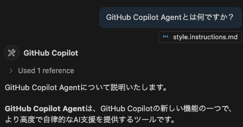
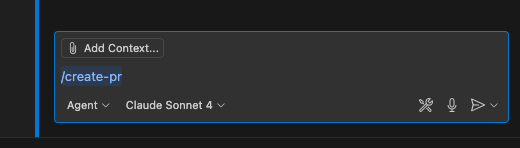

<!-- QRコード -->

---

# はじめまして

- 株式会社コドモン
  - 社内向けプロダクトの開発チームのマネージャー
- PHP歴: 3年
  - 20年前にWordPressで触ったのが初めてでした
- 生成AIやアジャイル、個人開発に興味があります
- 過去の登壇・記事
  - [だれかの進捗をうまく「把握」できないときのフレーズ集](https://www.youtube.com/watch?v=3KALSaO6K_U)
  - [本当はむずかしい「計画」のはなし](https://speakerdeck.com/koboriakira/ben-dang-hamuzukasii-ji-hua-nohanasi)
  - [残業なしで成果を出すためのあとまわし戦略](https://speakerdeck.com/codmoninc/can-ye-nasitecheng-guo-wochu-sutamenoatomawasizhan-lue)
- 女子プロレスが好きです

<!--
- プロレスでも第１試合、つまり最初が大事
-->

---

# 最初に、Claude Codeについて

2025年6月時点では、Claude Codeの導入検討をすべきかもしれない

- 2025年2月
  - 弊チームのGitHub Copilot Agent導入 
- 2025年5月
  - プロポーザル、採択
  - **Claude Code発表**

---

# さきに結論

---

# 結論

1. AIエージェントの利用は**全員で**やること
2. **IssueやPRの作成**から改善していく
3. **Copilot用のドキュメント**のメンテナンスに注力する

---

# GitHub Copilot Agentとは



* 通常のGitHub CopilotのEditモードよりは自律性が高い
* Devinよりは自律性が低い
* 総じて**はじめてのAIエージェントとしては適している**ように感じる

※以降GitHub Copilot Agentを`Agent`と表記

---

# 開発生産性の変化

* PR数: 200件 → 400件
  * コミット数: 1,000件 → 10,000件
* リリース: 30件 → 50件 <span class="secondary">(※)</span>

<span class="secondary">※業務改善による影響もあり。なおその改善もCopilotを利用しています</span>

---

# あたらしいツールを導入するときの大変さ

- あたらしいツールの導入には、すくなからずハードルがある
  - "採用する"理由がある一方で、"採用しない"理由もある
- ツールの利用や習熟に差ができてしまうことで、チーム内の分断が生まれる
  - 一度生まれた分断は広がりやすく、解消しにくい
- その分断を起こさないためには、チームでの共進化サイクルを回す必要がある
  - お互いに徐々に発展していく

<span class="secondary">※「AIエージェントの活用は必須スキルなのだから、各自で学ぶべき」「特定のメンバーが一気にやればよい」と考える向きも認める。しかしチームで成果を出すためには、できるかぎりハードルを下げるべき、というのが自身の経験論</span>

---

# 解消すべきこと

* **Agentの始め方がわからない** → Step1: Agentの導入
* **Agentを使う場面がない、面倒くさい** → Step2: promptの整備
* **Agentの出力に限界がある** → Step3: instructionのメンテナンス


<!--
チーム単位で効果を出すには、上記のような課題をひとつずつ解決せねばならない。
-->

---

# Step1: Agentの導入

---

# Step1: Agentの導入

1. Agentのインストールから最初の利用までを**ハンズオンで同期的に**行う
2. 全体的な**システムプロンプト**を準備しておく  
   <span class="secondary">※余裕があれば、後述のpromptも用意できるとベスト</span>

まずは「**始められない**」を解消すること。

<!--
- まずは効果の有無を問わず、全員がAgentを使える状態にする。
- ドキュメントによる非同期な導入も可能だが、ここで脱落する人がいるリスクは大きすぎる
-->

---

# システムプロンプトの中身

`.github/copilot-instructions.md`としてコミットする。

```.github/copilot-instructions.md
# やりとりについて

- 特定の指示がないかぎり、日本語での回答をしてください
- 特定の指示がないかぎり、一度のやりとりで行う修正は  
  ひとつのコミットレベルになる程度の規模にしてください
- 作業内容を簡潔にまとめたレポートを作成してください
    - `.github/copilot_logs/{YYYY-MM-DD}_{指示概要}.md`
```

<!--
- 
-->

---

# Step2: promptの整備

---

# Step2: promptの整備

"使いこなせる"と"使いこなせない人"との間の分断を避ける。

- **Issueの作成**
- 実装、テスト
- **PRの作成**
- その他（SQL作成、問い合わせ対応）



---

# なぜIssue/PRの作成のpromptを優先するのか？

- **人間がサボりやすい**業務である
- **ちゃんとやると時間のかかる**業務である
- 開発の始点・終点であるため、**開発の流れを変える**ことができる

<!--
仮に多少の誤りがあったとしても「Issueが作成されない」「PR本文が空欄」という事態は避けられる。
Agentに大量の文章を生成させたあとで、開発者が最初のレビュワーとして編集する流れになるとよい。
-->

---

# refs: Issue作成プロンプト

- **注意**
  - `./.github/prompts`以下に格納すること
    - ex. `./.github/prompts/github/create-issue.md`
  - GitHubのMCPサーバが必要です

```
GitHubの操作アシスタントとして、Issueを作成してください。

以下の情報が提供、もしくはこれまでのやりとりから想定できます。
もし情報が不足している場合は、ユーザに質問して補完してください。

- Issueのタイトル
- 概要
- 現時点でわかっている開発内容
- 期待される動作
```

<!-- FIXME: ライブデモやりたい -->

---

# プロンプト運用のコツ

- 「目的」をできるかぎり細かくする
- **入力必須な指示が減る**ように工夫する
  - 期待値だけ示し、現状や課題はAgentに考えさせる
- **次のプロンプト実行にスムーズにつなげる**、Agentの連鎖
  - Issue作成プロンプト内で、開発ブランチの提案およびそのIssueを解決するためのプロンプトを生成する
  - 上記プロンプトを実行して実装する
  - PR作成プロンプトを実行するとき、Issue番号や内容はこれまでの内容から自動的に補完できるようにする 
- **練習用ディレクトリも用意する** (`.github/prompts/temporary`)
  - いきなり本格運用ではなく、個人で試してから正式コミット

---

# Step3: instructionのメンテナンス

---

# Step3: instructionのメンテナンス

このあたりから「◯◯◯はできるけど、△△△はできない」という声が出てくる。
そのような声に応えるため、**Agentのinstructionをメンテナンスする**。

- `.github/instructions/`以下にカテゴリごとに格納すること
- `applyTo`を指定することで、どのファイルに適用されるルールかを指定できる

```.github/instructions/php/php-controller.instructions.md
---
applyTo: "src/Controller/**/*.php"
---

# コントローラーの実装
```

---

# メンテナンスのタイミング

- ひとつの作業指示やPRごとに検討する
- そのためのプロンプトを準備してしまうと楽

<span class="secondary">※「instructionsもAgentに全部書かせればよい」という意見もあるが、発表者は否定的。<br/>　Agentの大量出力の正しさを判定しきれず、結局コミットできないことが多かった。</span>

---

# メンテナンスのプロンプト例

```
ここまでのやりとりをもとに、次回以降のAIエージェント指示に  
活用できる情報を整理し、`.github/instructions/`以下の
任意のファイルを作成もしくは更新してください。

## 制約

- できるかぎり既存の`*.instructions.md`ファイルに追記するようにしてください
- 新規ファイルを作成する場合は、既存のファイルたちと  
  どのような違いがあるのかを明確にしてください
```

---

# instructionsに入れておくと便利だったもの

- テーブル定義(CREATE TABLE文)
- 利用するAPIの仕様書
  - 自社開発のAPIを別リポジトリで使う場合など
  - OpenAPI仕様書をときおりコピーする
- ユビキタス言語一覧 <span class="secondary">※チームでも開始したばかり</span>

---

# 結論

---

# 結論

Agentの利用を当たり前にするために、

- 不要なスキル差・分断を生まないように...
  - AIエージェントの利用は**全員で**やる
- 自然と使い始められるように...
  - **IssueやPRの作成プロンプト**から作成していく
- Agent利用の限界を決めないように...
  - **Copilot用のドキュメント**のメンテナンスに注力する
  - 完璧を目指すのではなく、指示が上手くいかないタイミングでメンテする

---

# Agentとチームがともに進化する未来へ！

---

# ご清聴ありがとうございます

<span class="secondary">懇親会には参加できず、ぜひお声がけください！</span>
<span class="secondary">ちなみに原宿ぽむ選手推しです！</span>

## 話したりないこと

- <span class="secondary">AIエージェントの活用により、開発者は**最初のレビュワー**になる</span>
- <span class="secondary">開発のスピード感や注意すべき点が変わる。あわせてチームのルールや文化を見直すべき</span>
- <span class="secondary">自分の業務のメタ認知が重要になってくる</span>


<!-- presenter notes 

notes:

* タイマーを 25:00 でスタート
* Demo 時間: Step1 slide 2 分以内、Step2 before/after 1.5 分
* If Q\&A なし→Takeaways 再掲で調整

-->
